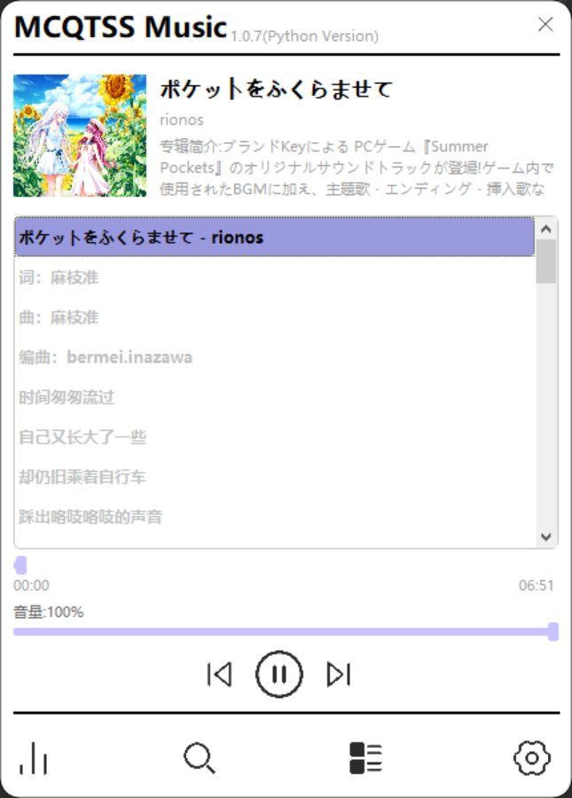

# MCQTSSMusic

### 一个基于Python开发的简易音乐播放器

### 音乐播放API使用QQ音乐,相关API等请参考[QQ音乐解析](https://github.com/MCQTSS/MCQTSS_QQMusic)

### 经测试支持Windows和Debian11 x86_64

### Centos等其他系统并未测试,Linux下UI可能存在部分Bug

## 支持功能:

### 播放音乐,歌词显示&匹配,搜索音乐,加载歌单&专辑列表,QQ音乐登录

## 界面展示

 

## 使用的第三方库&Python版本

| 名称             | 版本     | 额外说明                                                            |
|:---------------|:-------|-----------------------------------------------------------------|
| Python         | 3.10.0 |                                                                 |
| requests       | 2.31.0 | 网络请求                                                            |
| PyQt5          | 5.15.9 | 界面库                                                             |
| pybass3_mcqtss | 0.2.0  | 基于pybass3的个人修改,[项目地址](https://github.com/MCQTSS/pybass3_modify) |

#### 使用[Bass](https://www.un4seen.com/)和[pybass3](https://github.com/devdave/pybass3)作为音频播放模块

## 其他

### 有什么新想法/Bug/功能需求欢迎在issues或交流群中提

### 如果喜欢这个项目请记得给个Star或分享给朋友

#### [交流群:https://t.me/+Om4thlFinuFhYzc1](https://t.me/+Om4thlFinuFhYzc1)

## 赞助

### [爱发电](https://afdian.net/@mcqtss)